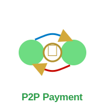
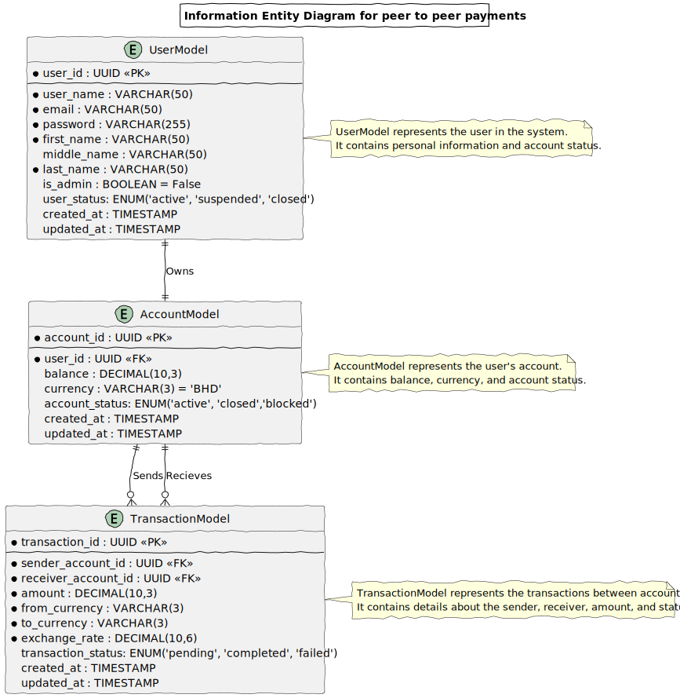

# fastapi-peer2peer-payments
A simple peer-to-peer payment system developed with FastAPI that allows users to send money to each other. The application supports user registration and login with JWT-based authentication, enabling secure access to user-specific features. Users can view their account balance, transaction history, and send money to other users, including automatic currency conversion with real-time exchange rates and a processing fee. Admin users have additional privileges to view the transaction history of any selected user. All endpoints enforce strict validation and authorization, ensuring only authenticated users can access sensitive operations. The simple system demonistrates the developer ability to design a fastapi webservices which provides clear error responses for invalid requests, insufficient permissions, or missing data, and maintains robust handling of user and transaction records.

## Getting started

### Data model
This application has a simple data model:
* UserModel: Contains users data and has one to one relationship with AccountModel meaning each user has one account only.
* AccountModel: Contains user account data and each account belongs to one user only.
* TransactionModel: Each transaction has a relationship with valid accounts and points to sender and receiver accounts.

### Application Routes

#### 🔐 Auth Routes

| HTTP Method | Endpoint        | Description                     | Who Can Access? | Notes                        | Workflow Respresentation |
|-------------|------------------|---------------------------------|------------------|-------------------------------|-------------------------------|
| POST        | /auth/signup     | Register a new user             | Public           | Stores hashed password        |[Signup Process](docs/diagrams/out/routes/signup_process.svg)|
| POST        | /auth/login      | Log in and receive JWT token    | Public           | Returns access token          |[Login Process](docs/diagrams/out/routes/login_process.svg)|

#### 👤 User & 🏦 Account Routes

| HTTP Method | Endpoint         | Description                       | Who Can Access? | Notes                                       | Workflow Respresentation |
|-------------|------------------|-----------------------------------|------------------|----------------------------------------------|----------------------------------------------|
| GET         | /users/me        | Get current user’s profile        | Logged-in users  | Returns username, email, and account ID      |[Get Current User Process](docs/diagrams/out/routes/get_current_user_details.svg)|
| GET         | /accounts/me     | View current user’s account balance | Logged-in users | Shows balance, currency, and account details |[Get Current User Account Process](docs/diagrams/out/routes/account_me.svg)|

#### 💸 Transaction Routes

| HTTP Method | Endpoint         | Description                       | Who Can Access? | Notes                                       | Workflow Respresentation |
|-------------|------------------|-----------------------------------|------------------|----------------------------------------------|----------------------------------------------|
| POST        | /transactions/send  | Transfer money to another user       | Logged-in users  | Requires sender’s ID, recipient’s ID, and amount. Prevents overdrafts. |[Send Transaction Process](docs/diagrams/out/routes/send_transaction.svg)|
| GET         | /transactions/history | View transaction history (sent & received) | Logged-in users  | Users can only view their own transactions                            |[Get Current User Transaction History Process](docs/diagrams/out/routes/get_current_user_transactions.svg)|

#### 🛠️ Stretch Goals: Admin Routes & External API Integration

| HTTP Method | Endpoint         | Description                       | Who Can Access? | Notes                                       | Workflow Respresentation |
|-------------|------------------|-----------------------------------|------------------|----------------------------------------------|----------------------------------------------|
| GET         | /transactions/{user_id}                  | View another user’s transactions     | Admins only      | For monitoring fraud or disputes                              |[Get User Transaction History By ID](docs/diagrams/out/routes/admin_view_user_transactions.svg)|
| GET         | /exchange-rate?from=USD&to=EUR           | Fetch real-time exchange rate        | Logged-in users  | Uses an external API to get live exchange rates (if implemented) |[Get Currency Exchange Rate](docs/diagrams/out/routes/get_exchange_rate.svg)|

## Technologies used

| 📦 Language/Library/Component | 🧠 Justification|
|----------------------------|--------------|
| **Python 3.11**            | To make sure that python run time supports all choosen libraries in this project|
| **FastAPI**  | Web framework for building APIs|
| **Asyncpg**  | Python driver library to connect to PostgreSQL Database it is faster than psycopg and does not require installation for postgresql tools on the system as it is capable of running by it is own|
| **SQLAlchemy** | Python wide known ORM library and some libraries such as SQLModel are built on top of it |
| **argon2-cffi** without Passlib |Argon2 by it self is an award winning library and it is been decided that only one hashing algorithm is going to be used and thus using a passlibrary is not essential in additional to that passlib is not actively maintained |
| **Pytest** | Test the application|
| **Pyjwt** | To deal with JWT tokens |
| **Uvicorn** | Production ASGI Server to run the wen APIS| 

## Attributions
